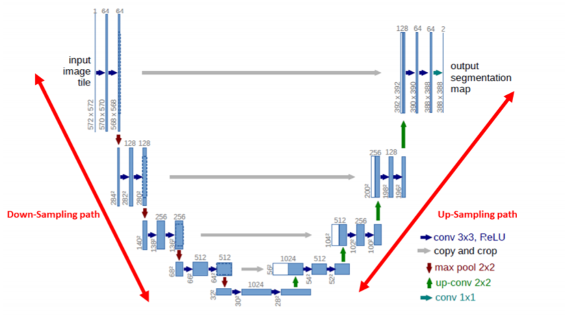
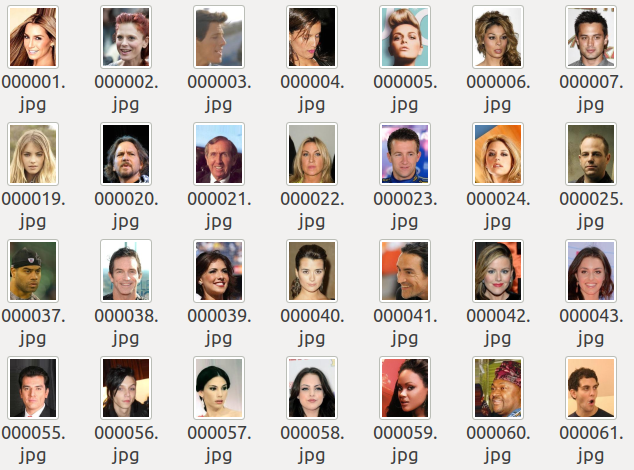
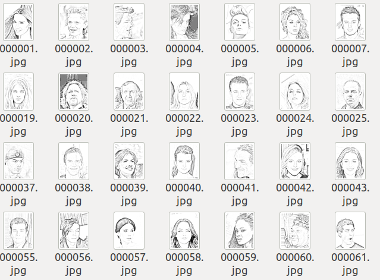
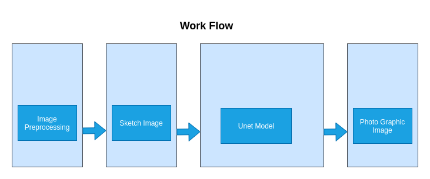
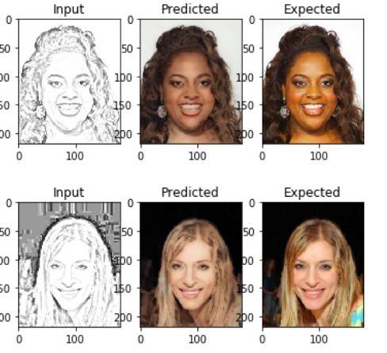
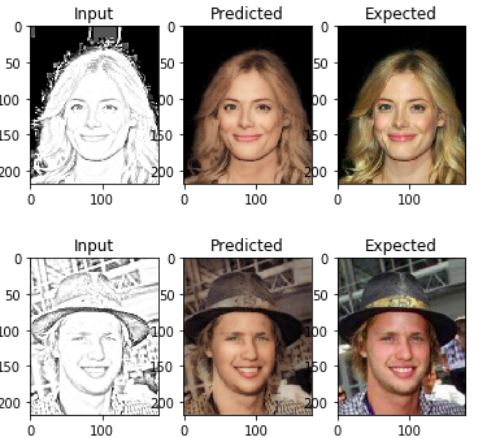
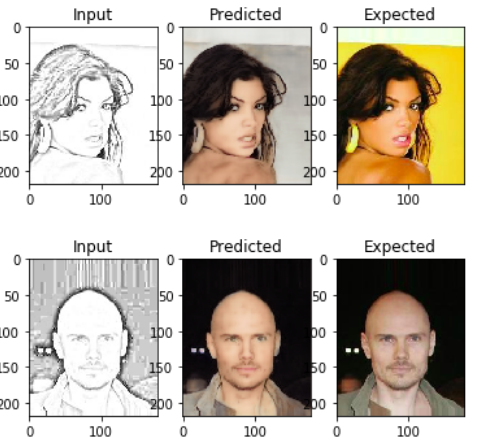
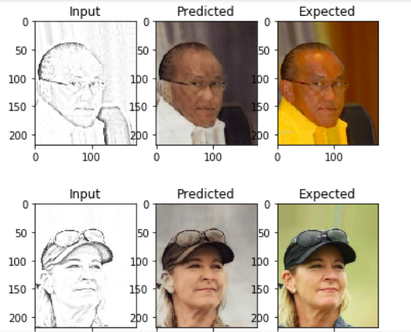

# Art to Image

A deep learning approach to make the city a better place.

We have made a project that would generate images from the provide sketches. Those sketches which are made by the mere guesses made by the eye witness and the sketch drawing artist. Thus, to give it a faster and far clear sight to those sketches, we came up with a data to generate the sharper images from those sketches. The produced images are made by using deep learning model, thus providing it a upper edge in the competing world.

Here it can be used for the following reasons:

1. ​	Detection of criminal people.
2. ​	Finding the lost people.
3. ​	Used in shops as to make the citizens feel safer and near to the organisations.
4. ​	Can be portable and accessed just by a click.
5. ​	Moreover, as the technology becomes common it would become more cost efficient.

**Model Architecture**

We used U-net with ResNet as backbone. U-net work on the concept of encoder and decoder. It has skip connections which help it to learn more features. It has proved great in many real world problems.

**Dataset**

We have the Celeb dataset download from kaggle : https://www.kaggle.com/jessicali9530/celeba-dataset

Then using image processing techniques we converted those images into sketch. The code related to this is in image2sketch.ipynb file.

**Flowchart**

This is the rough working steps of our architecture. First we perform image preprocessing like removing the noise on the input image. Then we pass that image to our model. Our model will output a photo graphic image. After that we can present that image in any required format.

 

**Results**

Our model was trained on a Nvidia GTX 1050 Ti for the whole night which is around 7-8 hrs and performed very well. Below are some of the results it has shown. 

    

